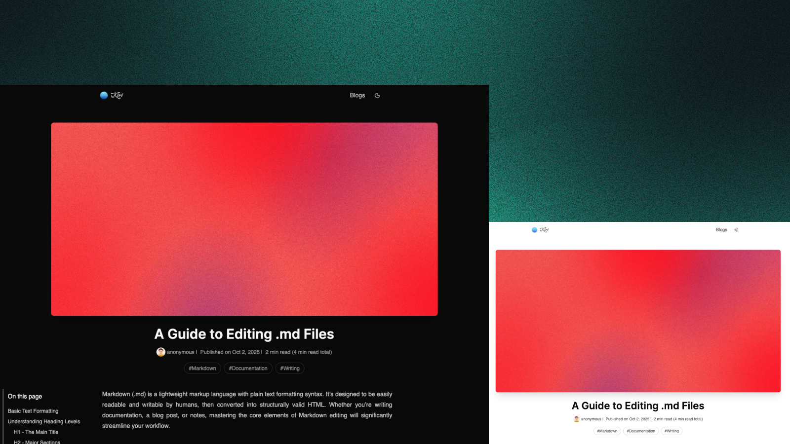

# 🌿 Kiri

**Kiri** is a **minimalistic personal blogging space** built with [Astro](https://astro.build) and [Tailwind CSS](https://tailwindcss.com).

It’s fast, lightweight, and accessible — designed for writers and developers who want a clean, distraction-free space to share their thoughts.

Kiri comes with **light & dark themes**, thoughtful typography, and modern blog essentials. It’s open-source, customizable, and ready to deploy as your personal corner on the web.  

---

## ✨ Features

- ⚡ **Blazing fast** — optimized with near-perfect Lighthouse scores  
- 📰 **RSS feed** — keep readers connected to your latest posts  
- 🌍 **Sitemap generation** — better SEO out of the box  
- 💻 **Syntax highlighting** — beautiful code snippets for technical posts  
- 🌗 **Light & dark mode** — built-in theme switcher  
- 📑 **Table of contents** — easy navigation for long-form articles  
- 📊 **Reading progress indicator** — know how far you’ve come  
- ♿ **Accessibility-first** — skip links, ARIA labels, and semantic markup  

---

## 🚀 Preview

  
*Minimal design, thoughtful details, and a space built for writing.*

Deployed with [Vercel](https://vercel.com) at [kiri-ten.vercel.app](https://kiri-ten.vercel.app/)

---

## 🛠️ Getting Started

1. **Create a repository with Kiri**  
   Click the "Use this template" button at the top of this page to create a new repository based on Kiri.

2. **Clone your new repository**

   ```bash
   git clone https://github.com/your-username/kiri.git
   cd kiri
   ```

3. **Install dependencies**

   ```bash
   bun install
   ```

   If you don't have Bun installed, you can get it from [bun.com](https://bun.com/).

4. **Run the development server**

   ```bash
   bun run dev
   ```

   The site will be live at `http://localhost:4321/`.

5. **Build for production**

   ```bash
   bun run build
   ```

   The output will be in the `.astro` directory.

---

## ✍️ Writing Blog Posts

1. **Create a new Markdown file**

   Add a new `.mdx` file in the `src/content/blogs/` directory. The filename will be used as the URL slug.

2. **Add frontmatter**

   At the top of your Markdown file, include the following frontmatter:

   ```yaml
   ---
   title: Your Post Title
   author: Author Name
   avatar: ./images/default-avatar.webp
   tags: ["Tag 1", "Tag 2"]
   publishedDate: 2025-10-02
   coverImage: ./images/default-background.webp
   excerpt: A brief summary of your post.
   ---
   ```

   Recommended dimensions for `coverImage` are 1024x576 pixels.

3. **Write your content**

   Use standard Markdown syntax to write your post. You can also include JSX components if needed.

---

## 📝 License

Kiri is open-source under the MIT License. Feel free to fork, tweak, and make it your own.

---

## 💡 Why Kiri?

The web is full of heavy, bloated blog engines. Kiri takes a different path —
it focuses on the essentials: speed, readability, ease of use, and accessibility.

Whether you’re journaling, writing technical tutorials, or just experimenting,
Kiri gives you a simple foundation that grows with you.

---

## ✨ Want a feature?

Feel free to open an issue or submit a pull request on GitHub. Contributions are welcome!

---

## ❤️ Like Kiri?

If you find Kiri useful, please give it a ⭐ on GitHub! It helps others discover the project and motivates me to keep improving it. Thank you!
